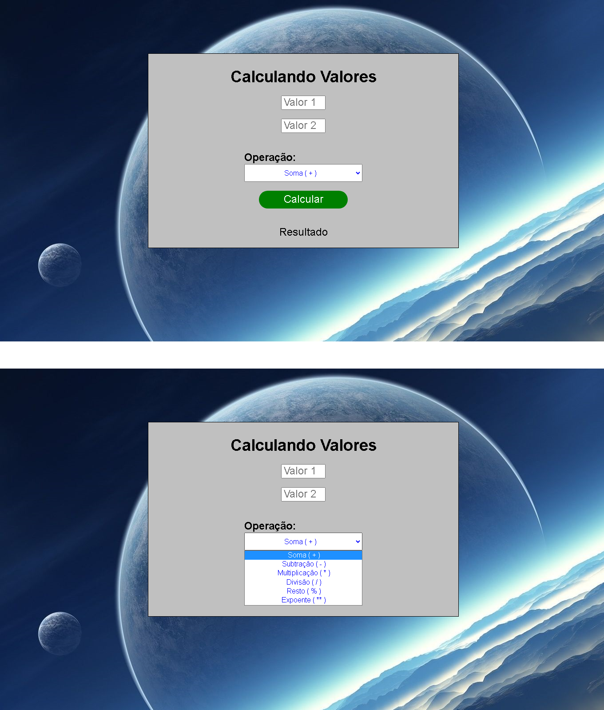

<h1>calculadora Input</h1>
Calculadora de operações básicas (+, -, *, /, %, **)

Soma ( + )

Subtração ( - )

Multiplicação ( * )

Divisão ( / )

Resto da Divisão ( % )

Exponencial ( ** )

<h1>Para Acessar, Clique <a href="https://edgarsousa21.github.io/09_calculadora_input/">Aqui</a></h1>
